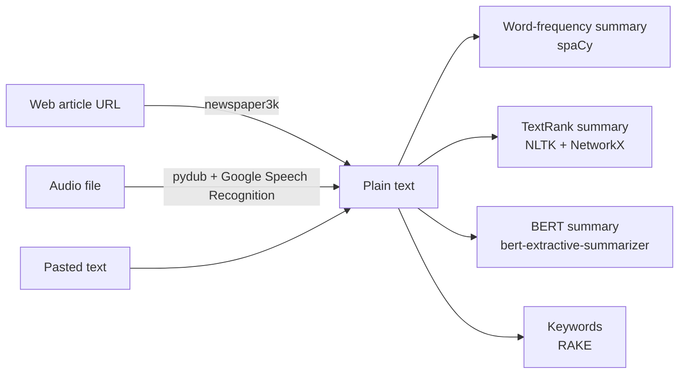

# Text Summarization and Keyword Extraction

A set of Jupyter notebooks that try different ways to summarize text and pull out keywords.

## What it does

The notebooks take text from a web article, an audio file, or pasted input. They then make a short summary or list the main keywords. Each notebook is a separate experiment; there is no single app that joins them.

## How it works



- **Word-frequency summary** (`Text_summarization_.ipynb`): scores each word by how often it appears, scores each sentence by its words, and keeps the top 20% of sentences.
- **Audio to text + TextRank** (`Audio_to_text.ipynb`): converts MP3 to WAV, splits it on silence, sends each chunk to Google Speech Recognition, then ranks sentences with PageRank over a cosine-similarity graph.
- **BERT summary** (`BERT_text_summarization_.ipynb`): uses `bert-extractive-summarizer` with BERT and Sentence-BERT (`paraphrase-MiniLM-L6-v2`), and uses the elbow method to choose the number of sentences.
- **Keyword extraction** (`Keyword_extraction_with_Rake_model.ipynb`): runs RAKE (`multi_rake`) on the input text and prints the top 10 phrases with scores.

All summaries are extractive: they pick existing sentences and do not write new ones.


## Quick start

The notebooks were written in Google Colab. Each one installs its own packages with `!pip install` in its first cells.

```bash
git clone https://github.com/Nodir0705/Summarizing-paragraphs-of-a-given-document-keywords-extraction-main.git
cd Summarizing-paragraphs-of-a-given-document-keywords-extraction-main
pip install notebook
jupyter notebook
```

Then open a notebook and run the cells from top to bottom. `Audio_to_text.ipynb` uses `google.colab.files.upload()`, so run it in Colab or replace that cell with a local file path.

## Project structure

- `Text_summarization_.ipynb` - word-frequency summary of a web article (also has early PDF-reading tests with PyPDF2)
- `Audio_to_text.ipynb` - speech to text, then TextRank summary
- `BERT_text_summarization_.ipynb` - BERT and Sentence-BERT summaries
- `Keyword_extraction_with_Rake_model.ipynb` - RAKE keyword extraction
- `High level design.png` - diagram of the planned system
- `Audio to text/`, `First concept text summarization/`, `High and low level Design/` - identical copies of the files above

## Notes

- This is a 2022 university group project, kept as a learning example.
- The "Open in Colab" links inside the notebooks point to the group's original repository, `ATrublie/Summarizing-paragraphs-of-a-given-document-keywords-extraction`.
- Some cells depend on files that are not in this repo, such as a PDF under `/content/` and `example.pdf`.
- The outputs saved in the notebooks come from Colab in 2022 (Python 3.7). Not tested with current package versions.

Concept map of the project:


